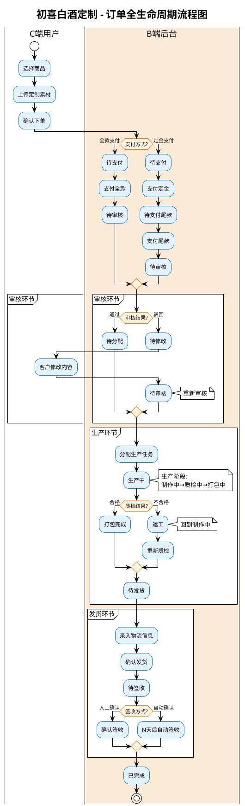
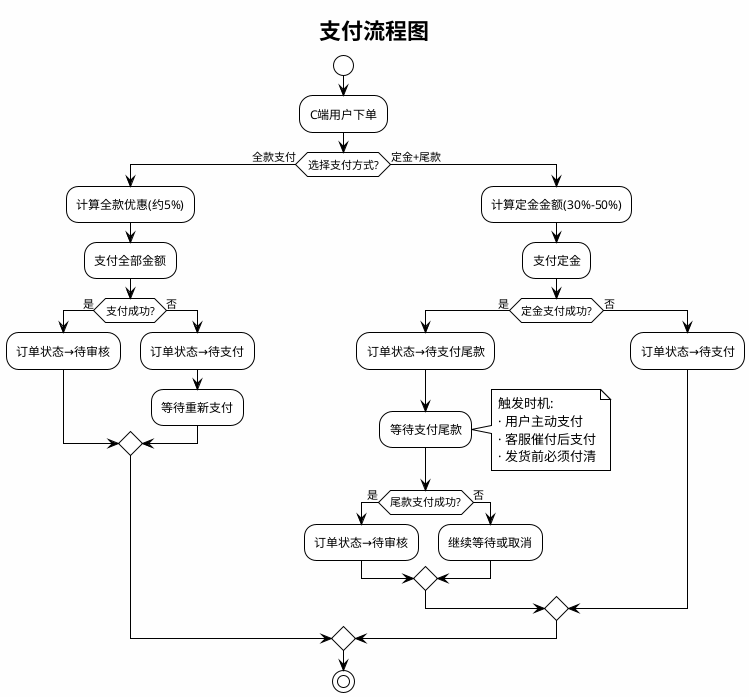
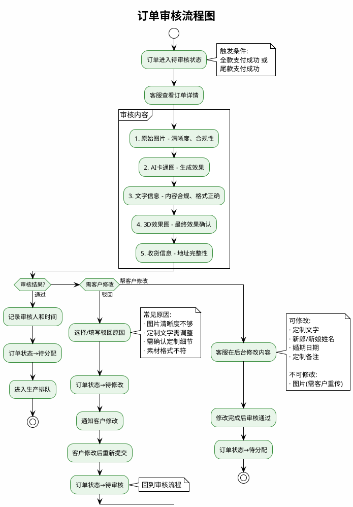
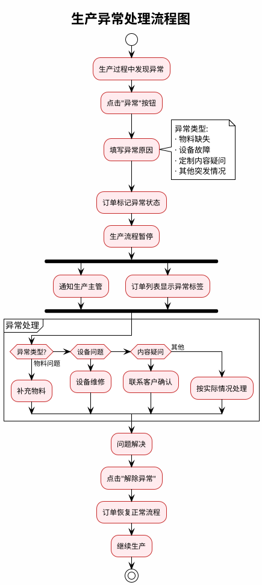
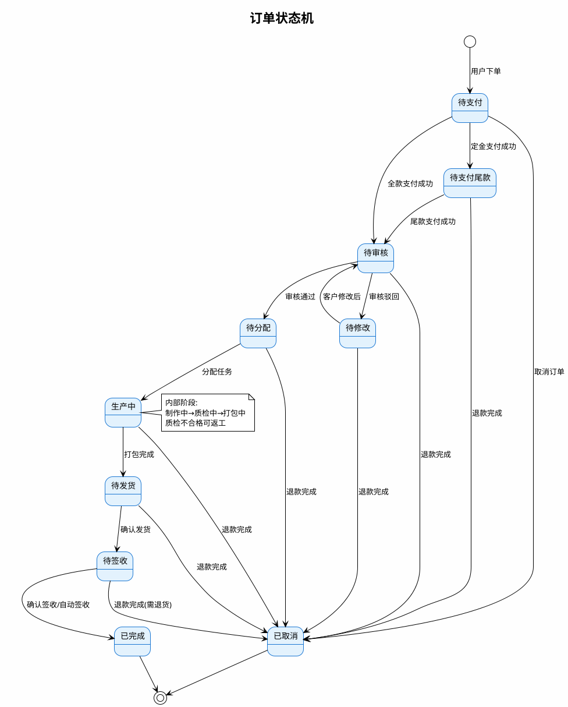
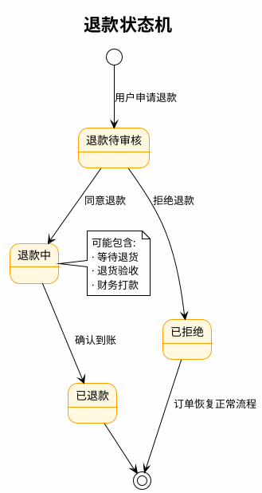
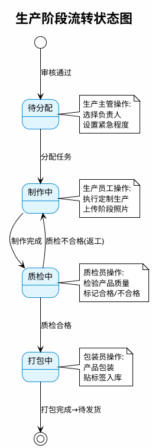
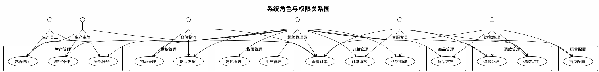
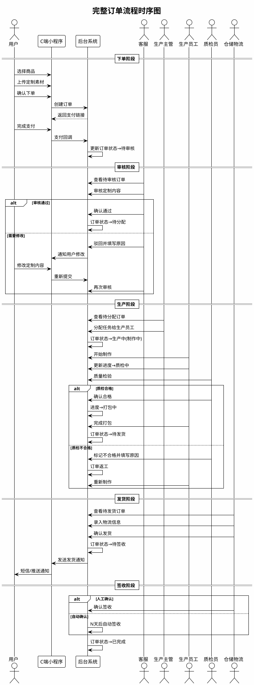

# 初喜白酒定制后台 - 业务流程图（PlantUML）

| 文档信息 | |
|---------|------|
| 创建日期 | 2025-12-12 |
| 文档版本 | V1.0 |
| 用途 | PlantUML 代码，可在 https://www.plantuml.com/plantuml 或其他工具转换为图片 |

---

## 一、订单全生命周期流程



---

## 二、支付流程



---

## 三、审核流程



---

## 四、生产流程

```plantuml
@startuml 生产流程
!theme plain
skinparam backgroundColor #FEFEFE
skinparam ActivityBackgroundColor #E1F5FE
skinparam ActivityBorderColor #0288D1

title 生产流程图

start

:审核通过，订单进入待分配;

|生产主管|
:查看待分配订单;
:分配生产任务;
note right
  分配信息:
  · 选择负责人
  · 设置紧急程度
  · 预计生产时长
end note

|生产员工|
partition 制作阶段 {
  :接收任务;
  :开始制作;
  note right
    定制生产:
    · 图案印刷
    · 文字刻印
  end note
  :更新进度→制作完成;
}

|质检员|
partition 质检阶段 {
  :质量检验;
  note right
    检验内容:
    · 外观检查
    · 内容核对
    · 质量标准
  end note
  
  if (质检结果?) then (合格)
    :更新进度→质检通过;
  else (不合格)
    :填写不合格原因;
    note right
      常见原因:
      · 印刷瑕疵/色差
      · 刻字错误/模糊
      · 产品划痕/破损
      · 包装不符要求
    end note
    :标记返工;
    :订单回到制作阶段;
    note right: 返工次数+1
    |生产员工|
    :重新制作;
    |质检员|
  endif
}

|包装员|
partition 打包阶段 {
  :产品包装;
  :贴标签;
  :入库;
  :更新进度→打包完成;
}

:订单状态→待发货;

stop

@enduml
```

---

## 五、生产异常处理流程



---

## 六、发货流程

```plantuml
@startuml 发货流程
!theme plain
skinparam backgroundColor #FEFEFE
skinparam ActivityBackgroundColor #F3E5F5
skinparam ActivityBorderColor #7B1FA2

title 发货流程图

start

:生产打包完成;
:订单进入待发货状态;

|仓储物流|
:查看待发货订单;

if (订单支付类型?) then (定金模式)
  if (尾款是否已付?) then (已付)
    :可以发货;
  else (未付)
    :阻止发货;
    :提示"尾款未付";
    |客服|
    :联系客户催付;
    :客户支付尾款;
    |仓储物流|
  endif
else (全款模式)
  :可以发货;
endif

:录入物流信息;
note right
  必填信息:
  · 物流公司
  · 运单号
end note

:确认发货;
:订单状态→待签收;
:发送发货短信通知客户;

partition 物流跟踪 {
  :运输中;
  note right
    物流状态跟踪
    (需对接物流API)
  end note
}

if (签收方式?) then (人工确认)
  :物流显示已签收;
  :点击"确认签收";
else (自动确认)
  :发货后N天;
  note right: 默认7-15天可配置
  :系统自动确认;
endif

:订单状态→已完成;

stop

@enduml
```

---

## 七、退款流程

```plantuml
@startuml 退款流程
!theme plain
skinparam backgroundColor #FEFEFE
skinparam ActivityBackgroundColor #FFF8E1
skinparam ActivityBorderColor #FFA000

title 退款流程图

start

|C端用户|
:申请退款;
note right
  可申请退款的状态:
  · 待支付
  · 待支付尾款
  · 待审核/待修改
  · 待分配
  · 生产中
  · 待发货
  · 待签收
  · 已完成
end note

:填写退款原因;
:提交退款申请;
:退款状态→退款待审核;

|客服|
:查看退款申请;
:核实订单情况;

if (审核结果?) then (同意)
  :确认退款金额;
  note right
    退款比例参考:
    · 未生产: 100%
    · 生产中: 25%-75%
    · 待发货: 0%-25%
    · 已发货: 需退货
  end note
  :退款状态→退款中;
  
  if (是否需要退货?) then (需要)
    partition 退货流程 {
      |C端用户|
      :寄回商品;
      :填写退货物流;
      |客服|
      :收到退货;
      :检验商品;
      if (商品状态?) then (完好)
        :确认可退款;
      else (异常)
        :协商扣款金额;
      endif
    }
  else (不需要)
    :直接退款;
  endif
  
  |财务|
  :执行退款;
  :点击"确认到账";
  :退款状态→已退款;
  :订单状态→已取消;
  
  |C端用户|
  :收到退款;
  
else (拒绝)
  |客服|
  :填写拒绝原因;
  note right
    常见拒绝原因:
    · 不属于质量问题
    · 超出退款时限
    · 不符合退款条件
  end note
  :退款状态→已拒绝;
  :通知客户;
  :订单恢复正常流程;
endif

stop

@enduml
```

---

## 八、订单状态机



---

## 九、退款状态机



---

## 十、生产阶段流转



---

## 十一、系统角色与权限



---

## 十二、业务时序图 - 完整订单流程



---

## 使用说明

1. **在线转换**: 
   - 访问 https://www.plantuml.com/plantuml
   - 粘贴代码块中的内容（不含 \`\`\`plantuml 标记）
   - 点击 Submit 生成图片

2. **本地工具**:
   - VS Code 安装 PlantUML 插件
   - IntelliJ IDEA 安装 PlantUML Integration 插件

3. **命令行**:
   ```bash
   java -jar plantuml.jar 文件名.puml
   ```

---

## 文档修订记录

| 版本 | 日期 | 修订内容 |
|-----|------|---------|
| V1.0 | 2025-12-12 | 初版发布，包含12个核心业务流程图 |

---

*文档结束*
